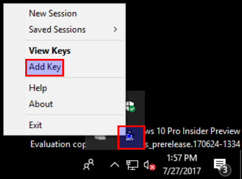

## Using PuTTY

### Installation
It is easier to use the MSI installer for PuTTY.  It will include pageant,
puttygen and putty which is all required.

- [x86 MSI](https://the.earth.li/~sgtatham/putty/latest/w32/putty-0.70-installer.msi)
- [x64 MSI](https://the.earth.li/~sgtatham/putty/latest/w64/putty-64bit-0.70-installer.msi)

### Import PEM

Open `PuTTYgen` - Start -> PuTTY -> PuTTYgen

Using the `Conversions` menu select `Import key`.  Select the PEM file and click `Open`.

Now click `Save private key` button and save as `awskey.ppk`.

### Add Key to Agent

Open `pageant` - Start -> PuTTY -> pageant

Right click the pageant icon and click `Add key`.

Find and select `awskey.ppk` and Click `Open` button.

### Configure PuTTY

Now the simple part.  

Open `PuTTY` - Start -> PuTTY -> PuTTY

In the `Host Name` input field use the provided hostname for an instance in AWS.

In the `Saved Session` input field use `aws` as the name of the session.  Click `Save`.  Then click `Open`.

If you need additional information please take a look at the following link: http://docs.aws.amazon.com/AWSEC2/latest/UserGuide/putty.html
