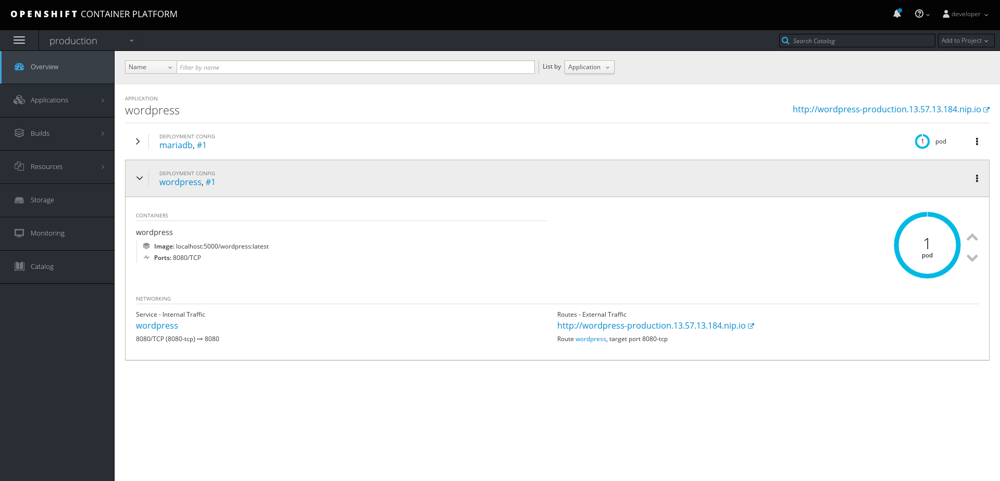
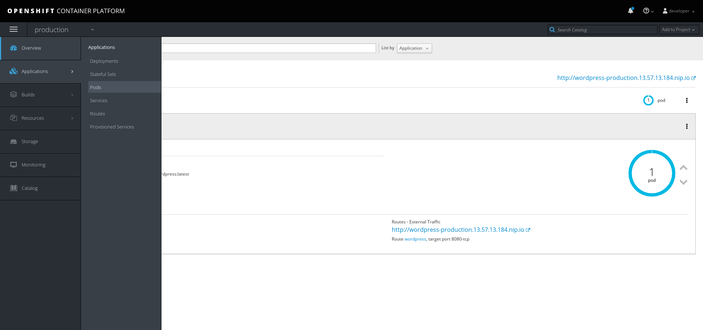
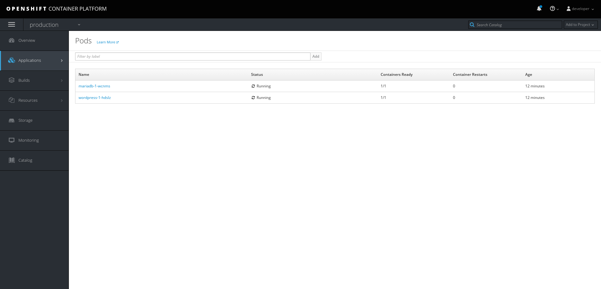
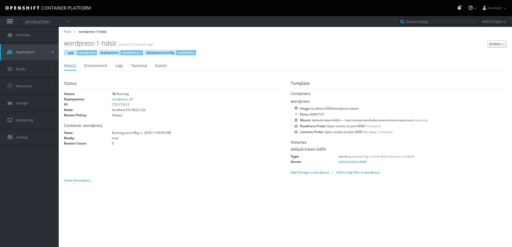

# LAB 5: OpenShift templates and web console

In this lab we introduce how to simplify your container deployments with OpenShift templates.  We will also explore the web console.

This lab should be performed on **YOUR ASSIGNED AWS VM** as `ec2-user` unless otherwise instructed.

Expected completion: 20 minutes

## Project preparation

Ensure you're still logged in as the developer user.
```shell
$ oc whoami
developer
```

Let's create a new project.
```bash
$ oc new-project production
Now using project "production" on server "https://10.xx.xx.xxx:8443".
```

## Wordpress templated deployment

This time, let's simplify things by deploying an application template.  We've already included a template with lab5 which leverages our wordpress & mariadb images.
```bash
$ cd ~/summit-2018-container-lab/labs/lab5/
$ grep localhost:5000 wordpress-template.yaml
```

Feel free to view the full template.

Let's deploy this wordpress template by adding your template to the production project
```bash
$ oc create -f wordpress-template.yaml
template "wordpress" created
```

Deploy your new template with "oc new-app" and note its output
```bash
$ oc new-app --template wordpress
--> Deploying template "production/wordpress" to project production
```

View all of the newly created resources
```bash
$ oc get all
```

Wait for rollout to finish
```bash
$ oc rollout status -w dc/mariadb
replication controller "mariadb-1" successfully rolled out

$ oc rollout status -w dc/wordpress
replication controller "wordpress-1" successfully rolled out
```

Verify the database started
```bash
$ oc logs dc/mariadb
mysqld_safe Starting mysqld daemon with databases from /var/lib/mysql
```

Verify wordpress started
```bash
$ oc logs dc/wordpress
/usr/sbin/httpd -D FOREGROUND
```

`oc status` gives a nice view of how these resources connect
```bash
$ oc status
```

Check and make sure you can access the wordpress service through it's route:
```bash
$ oc get routes
$ curl -L wordpress-production.<YOUR AWS VM PUBLIC IP>.nip.io
```

* Or open the URL in a browser to view the UI

OpenShift includes several ready-made templates. Let's take a look at some of them:
```shell
$ oc get templates -n openshift
```

For more information on templates, reference the official OpenShift documentation:

[https://docs.openshift.com/container-platform/latest/dev_guide/templates.html](https://docs.openshift.com/container-platform/latest/dev_guide/templates.html)

[https://docs.openshift.com/container-platform/latest/install_config/imagestreams_templates.html#is-templates-subscriptions](https://docs.openshift.com/container-platform/latest/install_config/imagestreams_templates.html#is-templates-subscriptions)

## Web console

Now that we have deployed our template, let’s login as developer to the OpenShift web console - `https://<YOUR AWS VM PUBLIC DNS NAME HERE>:8443`

The console url can be retrieved with:
```bash
$ oc cluster status

```

Login to the web console with the `developer` user.


And after we’ve logged in, we see a list of projects that the developer user has access to. Let's select the `production` project:


Our project landing page provides us with a high-level overview of our wordpress application's pods, services, and route:


Let's dive a little deeper. We want to view a list of our pods by clicking on `Pods` in the left Applications menu:


Next, let's click on one of our running pods for greater detail:


With this view, we have access to pod information like status, logs, image, volumes, and more:


Feel free to continue exploring the console.

In the final [bonus lab](../lab6/chapter6.md) you'll get to play with some new features, the service catalog and broker.
